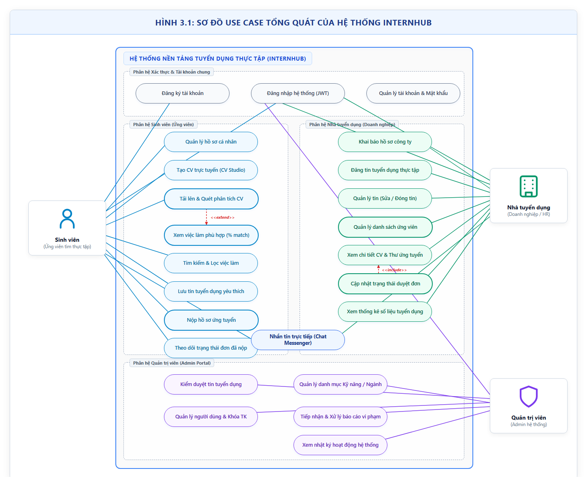
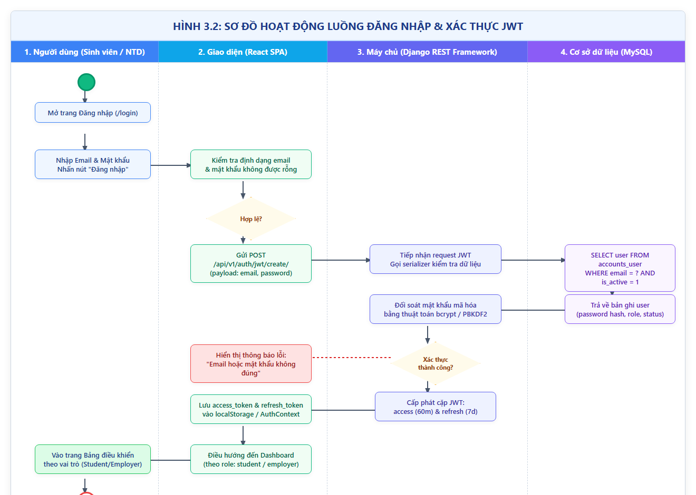
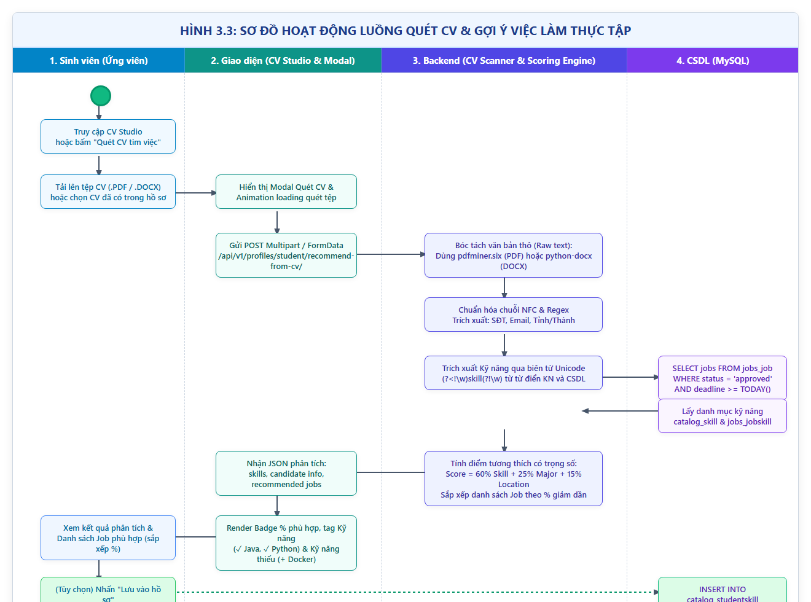
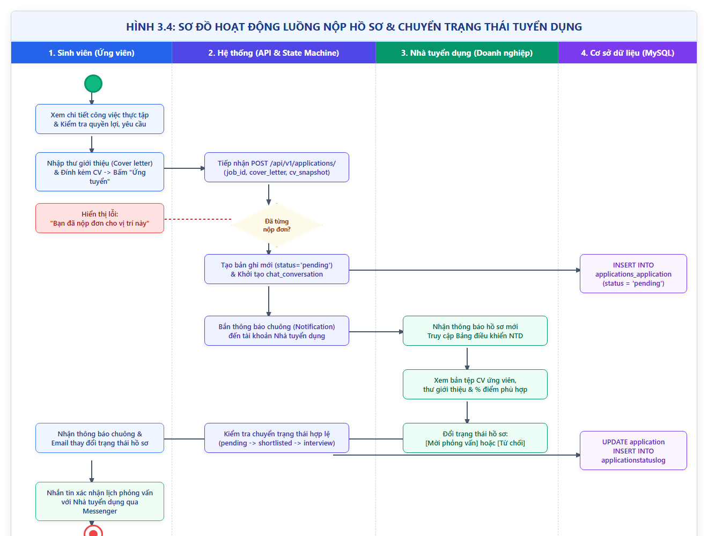
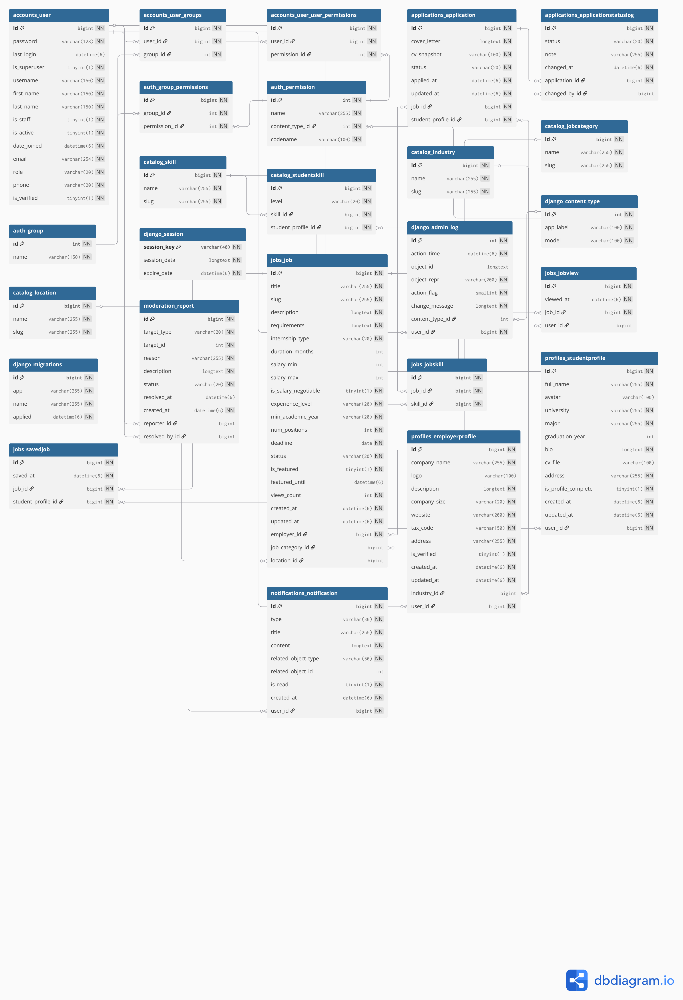

# BỘ THÔNG TIN VÀ TRUYỀN THÔNG
# HỌC VIỆN CÔNG NGHỆ BƯU CHÍNH VIỄN THÔNG
---

 

[Chèn hình ảnh: Đưa ảnh Logo Học viện Công nghệ Bưu chính Viễn thông PTIT vào đây]

# BÁO CÁO ĐỒ ÁN MÔN HỌC
## MÔN HỌC: QUẢN LÝ DỰ ÁN PHẦN MỀM

 

### ĐỀ TÀI:
# XÂY DỰNG NỀN TẢNG KẾT NỐI VÀ GỢI Ý VIỆC LÀM THỰC TẬP CHO SINH VIÊN (INTERNHUB)

 
 

**Giảng viên hướng dẫn:** TS. &lt;Điền tên Giảng viên hướng dẫn&gt;  
**Thực hiện bởi nhóm sinh viên, bao gồm:**  
1. **Nguyễn Minh Đức** &nbsp;&nbsp;&nbsp;&nbsp;&nbsp;&nbsp;&nbsp;&nbsp; MSSV: &lt;Điền MSSV&gt; &nbsp;&nbsp;&nbsp;&nbsp;&nbsp;&nbsp;&nbsp;&nbsp; Lớp: &lt;Điền Lớp&gt; &nbsp;&nbsp;&nbsp;&nbsp;&nbsp;&nbsp;&nbsp;&nbsp; **(Trưởng nhóm - Backend Lead)**  
2. **Trần Hưng Thịnh** &nbsp;&nbsp;&nbsp;&nbsp;&nbsp;&nbsp;&nbsp;&nbsp; MSSV: &lt;Điền MSSV&gt; &nbsp;&nbsp;&nbsp;&nbsp;&nbsp;&nbsp;&nbsp;&nbsp; Lớp: &lt;Điền Lớp&gt; &nbsp;&nbsp;&nbsp;&nbsp;&nbsp;&nbsp;&nbsp;&nbsp; **(Thành viên - Frontend Lead)**  
3. **Đức Minh** &nbsp;&nbsp;&nbsp;&nbsp;&nbsp;&nbsp;&nbsp;&nbsp;&nbsp;&nbsp;&nbsp;&nbsp;&nbsp;&nbsp;&nbsp;&nbsp;&nbsp;&nbsp;&nbsp; MSSV: &lt;Điền MSSV&gt; &nbsp;&nbsp;&nbsp;&nbsp;&nbsp;&nbsp;&nbsp;&nbsp; Lớp: &lt;Điền Lớp&gt; &nbsp;&nbsp;&nbsp;&nbsp;&nbsp;&nbsp;&nbsp;&nbsp; **(Thành viên - QA / Tester)**  

 

**TP. HỒ CHÍ MINH, THÁNG 10 / 2026**

---

\newpage

# MỤC LỤC

- [MỤC LỤC](#mục-lục)
- [DANH SÁCH HÌNH, BẢNG](#danh-sách-hình-bảng)
- [DANH MỤC TỪ VIẾT TẮT](#danh-mục-từ-viết-tắt)
- [CHƯƠNG I. TỔNG QUAN](#chương-i-tổng-quan)
  - [I. Giới thiệu đề tài](#i-giới-thiệu-đề-tài)
    - [1. Mục tiêu của đề tài](#1-mục-tiêu-của-đề-tài)
    - [2. Phạm vi áp dụng](#2-phạm-vi-áp-dụng)
    - [3. Nền tảng kỹ thuật](#3-nền-tảng-kỹ-thuật)
  - [II. Cơ sở lý thuyết](#ii-cơ-sở-lý-thuyết)
    - [1. Phương pháp luận Quản lý dự án phần mềm theo Agile / Scrum](#1-phương-pháp-luận-quản-lý-dự-án-phần-mềm-theo-agile--scrum)
    - [2. Kiến trúc Client - Server và thiết kế RESTful API](#2-kiến-trúc-client---server-và-thiết-kế-restful-api)
    - [3. Cơ chế xác thực và phân quyền bằng JSON Web Token (JWT)](#3-cơ-chế-xác-thực-và-phân-quyền-bằng-json-web-token-jwt)
    - [4. Kỹ thuật bóc tách dữ liệu tài liệu (Document Parsing) & Hệ thống gợi ý (Recommendation System)](#4-kỹ-thuật-bóc-tách-dữ-liệu-tài-liệu-document-parsing--hệ-thống-gợi-ý-recommendation-system)
- [CHƯƠNG II. PHÂN TÍCH NỘI DUNG, YÊU CẦU](#chương-ii-phân-tích-nội-dung-yêu-cầu)
  - [I. Giới thiệu quy trình 1: Quy trình dành cho Sinh viên (Tìm việc, Quét CV và Ứng tuyển)](#i-giới-thiệu-quy-trình-1-quy-trình-dành-cho-sinh-viên-tìm-việc-quét-cv-và-ứng-tuyển)
    - [1. Khảo sát nhu cầu và tạo lập hồ sơ cá nhân / CV trực tuyến](#1-khảo-sát-nhu-cầu-và-tạo-lập-hồ-sơ-cá-nhân--cv-trực-tuyến)
    - [2. Quét phân tích CV thông minh và nhận gợi ý việc làm tương thích](#2-quét-phân-tích-cv-thông-minh-và-nhận-gợi-ý-việc-làm-tương-thích)
    - [3. Nộp hồ sơ ứng tuyển, trao đổi trực tiếp và theo dõi trạng thái đơn](#3-nộp-hồ-sơ-ứng-tuyển-trao-đổi-trực-tiếp-và-theo-dõi-trạng-thái-đơn)
  - [II. Giới thiệu quy trình 2: Quy trình dành cho Doanh nghiệp (Đăng tin và Tuyển dụng)](#ii-giới-thiệu-quy-trình-2-quy-trình-dành-cho-doanh-nghiệp-đăng-tin-và-tuyển-dụng)
    - [1. Đăng ký thông tin doanh nghiệp và xác thực pháp lý](#1-đăng-ký-thông-tin-doanh-nghiệp-và-xác-thực-pháp-lý)
    - [2. Đăng tin tuyển dụng thực tập và quản lý vòng đời tin](#2-đăng-tin-tuyển-dụng-thực-tập-và-quản-lý-vòng-đời-tin)
    - [3. Sàng lọc hồ sơ ứng viên, cập nhật trạng thái tuyển dụng và trao đổi qua chat](#3-sàng-lọc-hồ-sơ-ứng-viên-cập-nhật-trạng-thái-tuyển-dụng-và-trao-đổi-qua-chat)
  - [III. Yêu cầu chức năng nghiệp vụ](#iii-yêu-cầu-chức-năng-nghiệp-vụ)
    - [1. Chức năng của đối tượng Sinh viên (Ứng viên)](#1-chức-năng-của-đối-tượng-sinh-viên-ứng-viên)
    - [2. Chức năng của đối tượng Doanh nghiệp (Nhà tuyển dụng)](#2-chức-năng-của-đối-tượng-doanh-nghiệp-nhà-tuyển-dụng)
    - [3. Chức năng của đối tượng Quản trị viên (Admin)](#3-chức-năng-của-đối-tượng-quản-trị-viên-admin)
  - [IV. Yêu cầu chức năng hệ thống và yêu cầu chất lượng](#iv-yêu-cầu-chức-năng-hệ-thống-và-yêu-cầu-chất-lượng)
    - [1. Yêu cầu về hiệu năng (Performance)](#1-yêu-cầu-về-hiệu-năng-performance)
    - [2. Yêu cầu về bảo mật và phân quyền (Security & Authorization)](#2-yêu-cầu-về-bảo-mật-và-phân-quyền-security--authorization)
    - [3. Yêu cầu về độ tin cậy và tính khả dụng (Reliability & Usability)](#3-yêu-cầu-về-độ-tin-cậy-và-tính-khả-dụng-reliability--usability)
- [CHƯƠNG III. PHÂN TÍCH THIẾT KẾ](#chương-iii-phân-tích-thiết-kế)
  - [I. Sơ đồ user case](#i-sơ-đồ-user-case)
    - [1. Sơ đồ Use case tổng quát hệ thống](#1-sơ-đồ-use-case-tổng-quát-hệ-thống)
    - [2. Sơ đồ Use case phân hệ Sinh viên](#2-sơ-đồ-use-case-phân-hệ-sinh-viên)
    - [3. Sơ đồ Use case phân hệ Doanh nghiệp](#3-sơ-đồ-use-case-phân-hệ-doanh-nghiệp)
    - [4. Sơ đồ Use case phân hệ Quản trị viên](#4-sơ-đồ-use-case-phân-hệ-quản-trị-viên)
  - [II. Sơ đồ hoạt động](#ii-sơ-đồ-hoạt-động)
    - [1. Sơ đồ hoạt động luồng Đăng nhập & Xác thực JWT](#1-sơ-đồ-hoạt-động-luồng-đăng-nhập--xác-thực-jwt)
    - [2. Sơ đồ hoạt động luồng Quét CV & Gợi ý việc làm thực tập](#2-sơ-đồ-hoạt-động-luồng-quét-cv--gợi-ý-việc-làm-thực-tập)
    - [3. Sơ đồ hoạt động luồng Nộp hồ sơ & Chuyển trạng thái tuyển dụng](#3-sơ-đồ-hoạt-động-luồng-nộp-hồ-sơ--chuyển-trạng-thái-tuyển-dụng)
  - [III. Thiết kế cơ sở dữ liệu](#iii-thiết-kế-cơ-sở-dữ-liệu)
    - [1. Mô hình ERD](#1-mô-hình-erd)
    - [2. Sơ đồ Diagram](#2-sơ-đồ-diagram)
    - [3. Cấu trúc các bảng](#3-cấu-trúc-các-bảng)
  - [IV. Thiết kế giao diện](#iv-thiết-kế-giao-diện)
  - [V. Thiết kế xử lý](#v-thiết-kế-xử-lý)
    - [1. Thiết kế xử lý thuật toán phân tích và bóc tách dữ liệu từ CV](#1-thiết-kế-xử-lý-thuật-toán-phân-tích-và-bóc-tách-dữ-liệu-từ-cv)
    - [2. Thiết kế thuật toán so khớp và tính điểm độ phù hợp việc làm (Scoring Model)](#2-thiết-kế-thuật-toán-so-khớp-và-tính-điểm-độ-phù-hợp-việc-làm-scoring-model)
    - [3. Thiết kế luồng chuyển trạng thái đơn ứng tuyển (Application State Machine)](#3-thiết-kế-luồng-chuyển-trạng-thái-đơn-ứng-tuyển-application-state-machine)
- [CHƯƠNG IV. PHÁT TRIỂN / THỰC THI](#chương-iv-phát-triển--thực-thi)
  - [I. Màn hình Trang chủ và Tìm kiếm việc làm thực tập](#i-màn-hình-trang-chủ-và-tìm-kiếm-việc-làm-thực-tập)
  - [II. Màn hình Chi tiết tin tuyển dụng & Nộp đơn ứng tuyển](#ii-màn-hình-chi-tiết-tin-tuyển-dụng--nộp-đơn-ứng-tuyển)
  - [III. Màn hình CV Studio & Modal Quét phân tích CV thông minh](#iii-màn-hình-cv-studio--modal-quét-phân-tích-cv-thông-minh)
  - [IV. Màn hình Bảng điều khiển Sinh viên (Student Dashboard & Việc làm phù hợp)](#iv-màn-hình-bảng-điều-khiển-sinh-viên-student-dashboard--việc-làm-phù-hợp)
  - [V. Màn hình Quản lý tin tuyển dụng & Hồ sơ ứng viên (Employer Portal)](#v-màn-hình-quản-lý-tin-tuyển-dụng--hồ-sơ-ứng-viên-employer-portal)
  - [VI. Màn hình Nhắn tin Messenger trực tiếp giữa Sinh viên và Nhà tuyển dụng](#vi-màn-hình-nhắn-tin-messenger-trực-tiếp-giữa-sinh-viên-và-nhà-tuyển-dụng)
  - [VII. Màn hình Quản trị viên (Admin Management Portal)](#vii-màn-hình-quản-trị-viên-admin-management-portal)
- [CHƯƠNG V. TRIỂN KHAI](#chương-v-triển-khai)
  - [I. Cài đặt](#i-cài-đặt)
    - [Danh sách tình trạng cài đặt các chức năng (kèm mức độ hoàn thành)](#danh-sách-tình-trạng-cài-đặt-các-chức-năng-kèm-mức-độ-hoàn-thành)
  - [II. Thử nghiệm](#ii-thử-nghiệm)
    - [1. Tài khoản dùng để test các chức năng của Sinh viên](#1-tài-khoản-dùng-để-test-các-chức-năng-của-sinh-viên)
    - [2. Tài khoản dùng để test các chức năng của Doanh nghiệp (Nhà tuyển dụng)](#2-tài-khoản-dùng-để-test-các-chức-năng-của-doanh-nghiệp-nhà-tuyển-dụng)
    - [3. Tài khoản dùng để test các chức năng của Quản trị viên](#3-tài-khoản-dùng-để-test-các-chức-năng-của-quản-trị-viên)
- [CHƯƠNG VI. KẾT LUẬN](#chương-vi-kết-luận)
  - [I. Kết quả đã thực hiện](#i-kết-quả-đã-thực-hiện)
  - [II. Ưu khuyết điểm](#ii-ưu-khuyết-điểm)
  - [III. Hướng mở rộng trong tương lai](#iii-hướng-mở-rộng-trong-tương-lai)
- [TÀI LIỆU THAM KHẢO](#tài-liệu-tham-khảo)

---

\newpage

# DANH SÁCH HÌNH, BẢNG

### Danh sách hình vẽ
- **Hình 1.1:** Mô hình phát triển phần mềm Agile / Scrum theo Sprint
- **Hình 3.1:** Sơ đồ Use case tổng quát của hệ thống InternHub
- **Hình 3.2:** Sơ đồ Hoạt động (Activity Diagram) luồng Đăng nhập & Xác thực JWT
- **Hình 3.3:** Sơ đồ Hoạt động luồng Quét CV & Gợi ý việc làm thực tập
- **Hình 3.4:** Sơ đồ Hoạt động luồng Nộp hồ sơ & Chuyển trạng thái tuyển dụng
- **Hình 3.5:** Mô hình thực thể liên kết (ERD) cơ sở dữ liệu InternHub (16 bảng)
- **Hình 3.6:** Sơ đồ lược đồ quan hệ Database Diagram
- **Hình 3.7:** Thiết kế khung nhìn Wireframe / Mockup các trang chính
- **Hình 4.1:** Màn hình Trang chủ và Tìm kiếm việc làm thực tập
- **Hình 4.2:** Màn hình Chi tiết tin tuyển dụng & Nộp đơn ứng tuyển
- **Hình 4.3:** Màn hình Trình dựng CV cá nhân (CV Studio - Builder)
- **Hình 4.4:** Màn hình Modal Quét phân tích CV và Bóc tách kỹ năng tự động
- **Hình 4.5:** Màn hình Bảng điều khiển Sinh viên - Danh sách Việc làm phù hợp theo %
- **Hình 4.6:** Màn hình Quản lý hồ sơ ứng viên và Duyệt/Từ chối của Doanh nghiệp
- **Hình 4.7:** Màn hình Khung Chat Messenger trao đổi trực tiếp giữa Sinh viên và Doanh nghiệp
- **Hình 4.8:** Màn hình Bảng điều khiển Quản trị viên (Admin Dashboard & Moderation)

### Danh sách bảng biểu
- **Bảng 1.1:** Tổng hợp công nghệ sử dụng trong hệ thống (Tech Stack)
- **Bảng 2.1:** Bảng phân tích yêu cầu nghiệp vụ đối tượng Sinh viên
- **Bảng 2.2:** Bảng phân tích yêu cầu nghiệp vụ đối tượng Doanh nghiệp (Nhà tuyển dụng)
- **Bảng 2.3:** Bảng phân tích yêu cầu nghiệp vụ đối tượng Quản trị viên (Admin)
- **Bảng 3.1:** Bảng cấu trúc thực thể `ACCOUNTS_USER`
- **Bảng 3.2:** Bảng cấu trúc thực thể `PROFILES_STUDENTPROFILE`
- **Bảng 3.3:** Bảng cấu trúc thực thể `PROFILES_EMPLOYERPROFILE`
- **Bảng 3.4:** Bảng cấu trúc thực thể `JOBS_JOB`
- **Bảng 3.5:** Bảng cấu trúc thực thể `JOBS_JOBSKILL`
- **Bảng 3.6:** Bảng cấu trúc thực thể `JOBS_SAVEDJOB`
- **Bảng 3.7:** Bảng cấu trúc thực thể `JOBS_JOBVIEW`
- **Bảng 3.8:** Bảng cấu trúc thực thể `APPLICATIONS_APPLICATION`
- **Bảng 3.9:** Bảng cấu trúc thực thể `APPLICATIONS_APPLICATIONSTATUSLOG`
- **Bảng 3.10:** Bảng cấu trúc thực thể `CATALOG_SKILL`
- **Bảng 3.11:** Bảng cấu trúc thực thể `CATALOG_STUDENTSKILL`
- **Bảng 3.12:** Bảng cấu trúc thực thể `CATALOG_LOCATION`
- **Bảng 3.13:** Bảng cấu trúc thực thể `CATALOG_JOBCATEGORY`
- **Bảng 3.14:** Bảng cấu trúc thực thể `CATALOG_INDUSTRY`
- **Bảng 3.15:** Bảng cấu trúc thực thể `NOTIFICATIONS_NOTIFICATION`
- **Bảng 3.16:** Bảng cấu trúc thực thể `MODERATION_REPORT`
- **Bảng 5.1:** Danh sách tình trạng cài đặt các chức năng và mức độ hoàn thành
- **Bảng 5.2:** Bảng thông tin tài khoản thử nghiệm hệ thống

---

\newpage

# DANH MỤC TỪ VIẾT TẮT

| Từ viết tắt | Tên tiếng Anh đầy đủ | Ý nghĩa / Giải thích |
|---|---|---|
| **QLPM** | Quản lý dự án phần mềm | Môn học và phương pháp quản trị dự án công nghệ thông tin |
| **API** | Application Programming Interface | Giao diện lập trình ứng dụng |
| **REST** | Representational State Transfer | Kiểu kiến trúc truyền tải trạng thái đại diện |
| **JWT** | JSON Web Token | Tiêu chuẩn mở truyền tải thông tin an toàn dưới dạng chuỗi JSON |
| **ERD** | Entity Relationship Diagram | Sơ đồ mối quan hệ thực thể trong cơ sở dữ liệu |
| **CRUD** | Create, Read, Update, Delete | Bốn thao tác dữ liệu cơ bản: Thêm, Đọc, Sửa, Xóa |
| **UI / UX** | User Interface / User Experience | Giao diện người dùng và Trải nghiệm người dùng |
| **DRF** | Django REST Framework | Thư viện xây dựng RESTful Web API cho nền tảng Django |
| **M2M** | Many-to-Many | Mối quan hệ Nhiều - Nhiều giữa các bảng trong CSDL quan hệ |
| **SPA** | Single Page Application | Ứng dụng trang đơn tải động không reload trang |
| **QA / QC** | Quality Assurance / Quality Control | Đảm bảo và kiểm soát chất lượng phần mềm |
| **E2E** | End-to-End | Kiểm thử tích hợp toàn diện từ đầu tới cuối |
| **PDF** | Portable Document Format | Định dạng tài liệu số di động |
| **DOCX** | Office Open XML Document | Định dạng tài liệu văn bản Microsoft Word nén XML |

---

\newpage

# CHƯƠNG I. TỔNG QUAN

## I. Giới thiệu đề tài

### 1. Mục tiêu của đề tài
Trong thời kỳ chuyển đổi số và thị trường việc làm công nghệ cạnh tranh gay gắt, giai đoạn thực tập là bước đệm then chốt giúp sinh viên đại học/cao đẳng cọ xát thực tế, tích lũy kinh nghiệm và mở rộng cơ hội việc làm chính thức. Tuy nhiên, thực tế quá trình tìm kiếm cơ hội thực tập hiện nay đang gặp phải nhiều rào cản lớn:
- **Về phía sinh viên:** Thường rơi vào trạng thái "rải CV" hàng loạt nhưng thiếu định hướng, không đánh giá được mức độ phù hợp giữa kỹ năng hiện có với yêu cầu thực tế của nhà tuyển dụng; gặp khó khăn trong việc thiết kế một bản CV đạt chuẩn và thiếu kênh tương tác phản hồi trực tiếp với doanh nghiệp.
- **Về phía doanh nghiệp tuyển dụng:** Nhận hàng trăm bộ hồ sơ mỗi đợt nhưng phần lớn không đáp ứng đúng kỹ năng trọng tâm; mất nhiều thời gian lọc hồ sơ thủ công và thiếu các công cụ trao đổi chuyên nghiệp, khép kín dành riêng cho ứng viên thực tập.

Xuất phát từ thực trạng trên, đề tài **"Xây dựng nền tảng kết nối và gợi ý việc làm thực tập cho sinh viên (InternHub)"** được nghiên cứu và phát triển nhằm:
1. Xây dựng một cổng thông tin tuyển dụng thực tập trực quan, hiện đại, kết nối trực tiếp sinh viên và các doanh nghiệp tuyển dụng.
2. Ứng dụng **thuật toán gợi ý cá nhân hóa (Recommendation Algorithm)** và **bóc tách dữ liệu từ file CV (CV Parsing)** để tự động đánh giá độ phù hợp (tính theo tỷ lệ %) giữa năng lực sinh viên và tin tuyển dụng.
3. Cung cấp bộ công cụ khép kín: Trình tạo CV chuẩn mẫu (CV Studio), Quét phân tích CV tự động, Nộp đơn trực tuyến, Trao đổi tin nhắn tức thì (Messenger) và Cập nhật trạng thái tuyển dụng theo thời gian thực.
4. Áp dụng quy trình chuẩn về **Quản lý dự án phần mềm theo mô hình Agile / Scrum**, sử dụng Jira để quản lý backlog, sprints và phân công vai trò nhiệm vụ rõ ràng trong nhóm phát triển.

### 2. Phạm vi áp dụng
- **Đối tượng người dùng trực tiếp:**
  - **Sinh viên (Ứng viên):** Sinh viên năm 2, 3, 4 hoặc sinh viên mới tốt nghiệp có nhu cầu tìm kiếm việc làm thực tập, xây dựng CV và đo lường độ tương thích kỹ năng với thị trường lao động.
  - **Doanh nghiệp (Nhà tuyển dụng):** Các công ty, doanh nghiệp công nghệ, startup hoặc phòng nhân sự có nhu cầu tuyển dụng thực tập sinh các chuyên ngành (Phần mềm, Marketing, Data, Thiết kế, Kinh doanh...).
  - **Quản trị viên (Admin hệ thống):** Đơn vị quản lý cổng thông tin thực hiện kiểm duyệt tin tuyển dụng, xác minh thông tin doanh nghiệp và xử lý báo cáo vi phạm.
- **Phạm vi hệ thống:** Vận hành trên nền tảng Web Application, tương thích tốt trên cả máy tính để bàn (Desktop) và các thiết bị di động (Mobile Responsive).

### 3. Nền tảng kỹ thuật
Dự án được xây dựng dựa trên kiến trúc phân tách độc lập (Decoupled Architecture) giữa Frontend và Backend nhằm tối ưu hóa hiệu năng, dễ dàng bảo trì và mở rộng:

*Bảng 1.1: Tổng hợp công nghệ sử dụng trong hệ thống (Tech Stack)*
| Thành phần | Công nghệ / Thư viện | Vai trò |
|---|---|---|
| **Backend Framework** | Python 3.13, Django 6.1 | Nền tảng xử lý logic phía máy chủ |
| **REST API** | Django REST Framework (DRF) | Xây dựng hệ thống RESTful API chuẩn JSON |
| **Cơ sở dữ liệu** | MySQL 8.4 (PyMySQL driver qua Laragon) | Hệ quản trị cơ sở dữ liệu quan hệ lưu trữ 16 bảng |
| **Xác thực & Bảo mật**| `djangorestframework-simplejwt` | Cơ chế xác thực phân quyền qua JWT (Access & Refresh Token) |
| **Xử lý tài liệu CV** | `pdfminer.six`, `python-docx` | Bóc tách văn bản, kỹ năng, số điện thoại, email từ file PDF & DOCX |
| **Frontend Framework**| React 19, Vite | Thư viện UI xây dựng Single Page Application (SPA) tốc độ cao |
| **Routing & Client** | React Router v7, Axios | Điều hướng trang và gọi API bất đồng bộ |
| **Styling & Icons** | Vanilla CSS, Bootstrap Icons | Thiết kế giao diện hiện đại, tối ưu responsive |
| **Quản lý dự án** | Jira Software, Git / GitHub | Quản lý quy trình Scrum, Sprint Backlog và mã nguồn phiên bản |

---

## II. Cơ sở lý thuyết

### 1. Phương pháp luận Quản lý dự án phần mềm theo Agile / Scrum
Dự án được triển khai tuân thủ quy trình Agile/Scrum gồm 8 tuần tương ứng với các Sprint được quản lý minh bạch trên Jira:
- **Product Backlog & User Stories:** Toàn bộ tính năng được phân rã thành các Epic, User Story và Task với độ ưu tiên rõ ràng (High, Medium, Low).
- **Phân công vai trò theo chuẩn Scrum:**
  - *Product Owner / Team Leader & Backend Lead (Nguyễn Minh Đức):* Chịu trách nhiệm kiến trúc CSDL, hệ thống API, bảo mật và thuật toán gợi ý.
  - *Frontend Lead (Trần Hưng Thịnh):* Chịu trách nhiệm thiết kế giao diện UI/UX, tích hợp API, xây dựng CV Studio và hệ thống thông báo/tin nhắn.
  - *Quality Assurance / Tester (Đức Minh):* Xây dựng kịch bản kiểm thử, thực hiện kiểm thử chức năng, tích hợp E2E và quản trị tài liệu báo cáo.
- **Sprint Cycle:** Mỗi Sprint hoàn thiện một gói tính năng độc lập, kiểm thử tích hợp trước khi tích hợp vào nhánh chính `main`.

[Chèn hình ảnh: Đưa ảnh Mô hình phát triển phần mềm Agile / Scrum theo Sprint vào đây]

*Hình 1.1: Mô hình phát triển phần mềm Agile / Scrum theo Sprint*

### 2. Kiến trúc Client - Server và thiết kế RESTful API
- Mô hình kiến trúc phân tách hoàn toàn giữa giao diện (React SPA) và nghiệp vụ (Django REST API).
- Tương tác thông qua các giao thức HTTP tiêu chuẩn (`GET`, `POST`, `PATCH`, `DELETE`) với dữ liệu định dạng chuẩn `application/json`.
- Sử dụng quy chuẩn mã trạng thái phản hồi HTTP: `200 OK`, `201 Created`, `400 Bad Request`, `401 Unauthorized`, `403 Forbidden`, `404 Not Found`.

### 3. Cơ chế xác thực và phân quyền bằng JSON Web Token (JWT)
- Loại bỏ session cookie truyền thống phía server để giảm tải bộ nhớ và hỗ trợ kiến trúc phi trạng thái (Stateless).
- **Quy trình cấp phát token:**
  - Khi đăng nhập thành công, máy chủ phát hành cặp khóa: `access_token` (thời hạn sống 60 phút) và `refresh_token` (thời hạn sống 7 ngày).
  - Phía Client đính kèm token trong HTTP Request Header: `Authorization: Bearer <access_token>`.
  - Cơ chế **Token Rotation**: Mỗi lần đổi `access_token` mới, một `refresh_token` mới đồng thời được cấp phát và hủy token cũ, bảo đảm an toàn trước các cuộc tấn công đánh cắp phiên làm việc.

### 4. Kỹ thuật bóc tách dữ liệu tài liệu (Document Parsing) & Hệ thống gợi ý (Recommendation System)
- **Document Parsing:** Quá trình chuyển đổi dữ liệu không có cấu trúc từ các tệp tin văn bản (PDF, DOCX) thành văn bản thuần có thể đọc được bằng máy tính thông qua phân tích cú pháp cây văn bản và bảng XML nén.
- **Hệ thống gợi ý theo quy tắc kết hợp (Rule-based & Similarity Filtering):** Kết hợp độ đo tương đồng tập hợp dựa trên các thuộc tính then chốt: Kỹ năng chuyên môn, Chuyên ngành học tập và Vị trí địa lý.

---

\newpage

# CHƯƠNG II. PHÂN TÍCH NỘI DUNG, YÊU CẦU

## I. Giới thiệu quy trình 1: Quy trình dành cho Sinh viên (Tìm việc, Quét CV và Ứng tuyển)

### 1. Khảo sát nhu cầu và tạo lập hồ sơ cá nhân / CV trực tuyến
- Sinh viên đăng ký tài khoản với vai trò "Student", kích hoạt tài khoản và điền thông tin định danh (Trường đại học, Chuyên ngành, Năm tốt nghiệp, Địa chỉ sinh sống).
- Sử dụng công cụ **CV Studio** để soạn thảo bản CV chuyên nghiệp trực tiếp trên trình duyệt với 3 phong cách thiết kế: *Tối giản (Classic)*, *Hiện đại (Modern)*, *Chuyên nghiệp (Professional)*.
- Hỗ trợ xem trước (Preview) theo thời gian thực và xuất bản CV sang định dạng PDF để tải về máy.

### 2. Quét phân tích CV thông minh và nhận gợi ý việc làm tương thích
- Sinh viên tải tệp CV có sẵn (PDF, DOCX) lên hệ thống.
- Hệ thống kích hoạt module phân tích để bóc tách:
  - Thông tin liên hệ (Email, Số điện thoại).
  - Vị trí địa lý / Thành phố sinh sống.
  - Danh mục các kỹ năng công nghệ và kỹ năng mềm.
- Ứng viên có thể bấm **"Lưu vào hồ sơ"** để tự động cập nhật các kỹ năng vừa quét vào kho dữ liệu kỹ năng của mình chỉ với 1 thao tác.
- Hệ thống lập tức đối sánh với toàn bộ các tin tuyển dụng đang hoạt động và trả về danh sách các cơ hội thực tập phù hợp nhất được xếp hạng theo điểm số tương thích (%).

### 3. Nộp hồ sơ ứng tuyển, trao đổi trực tiếp và theo dõi trạng thái đơn
- Sinh viên duyệt chi tiết tin tuyển dụng: nắm bắt quyền lợi, mức lương trợ cấp, mô tả và yêu cầu kỹ năng.
- Thực hiện nộp đơn trực tuyến kèm theo thư giới thiệu (Cover letter) và bản tệp CV đính kèm.
- Quy định ràng buộc: Mỗi sinh viên chỉ được nộp đơn **duy nhất 1 lần** cho mỗi vị trí công việc.
- Sau khi nộp đơn, hội thoại chat riêng biệt được tạo tự động giữa sinh viên và nhà tuyển dụng.
- Sinh viên theo dõi lịch sử trạng thái hồ sơ (*Chờ xử lý $\rightarrow$ Đã xem xét $\rightarrow$ Mời phỏng vấn $\rightarrow$ Được chấp nhận / Từ chối*) qua bảng điều khiển cá nhân và nhận thông báo chuông tức thời.

---

## II. Giới thiệu quy trình 2: Quy trình dành cho Doanh nghiệp (Đăng tin và Tuyển dụng)

### 1. Đăng ký thông tin doanh nghiệp và xác thực pháp lý
- Nhà tuyển dụng đăng ký tài khoản với vai trò "Employer", khai báo tên công ty, quy mô nhân sự, mã số thuế, địa chỉ trụ sở, website và logo nhận diện.
- Thông tin doanh nghiệp sau khi khai báo sẽ hiển thị trang giới thiệu công ty (Company Profile) công khai cho tất cả ứng viên tra cứu.

### 2. Đăng tin tuyển dụng thực tập và quản lý vòng đời tin
- Doanh nghiệp soạn thảo tin tuyển dụng: Tiêu đề công việc, Vị trí tuyển dụng, Địa điểm làm việc, Hình thức (Toàn thời gian, Bán thời gian, Từ xa, Kết hợp), Mức trợ cấp lương, Số lượng cần tuyển và Hạn chót nộp hồ sơ.
- Nhập chi tiết các yêu cầu kỹ năng và mô tả công việc.
- Quản lý vòng đời tin tuyển dụng: Chờ duyệt $\rightarrow$ Đã duyệt $\rightarrow$ Đóng tin / Gia hạn tin.

### 3. Sàng lọc hồ sơ ứng viên, cập nhật trạng thái tuyển dụng và trao đổi qua chat
- Tiếp nhận danh sách hồ sơ nộp về theo từng tin tuyển dụng.
- Xem trực tiếp bản tệp CV và nội dung thư ứng tuyển của sinh viên.
- Thực hiện cập nhật trạng thái đơn ứng tuyển (Shortlisted, Phỏng vấn, Trúng tuyển, Từ chối). Hệ thống sẽ tự động gửi thông báo đến tài khoản của sinh viên tương ứng.
- Nhắn tin trực tiếp với ứng viên thông qua giao diện Chat Messenger để gửi lịch hẹn phỏng vấn hoặc giải đáp thắc mắc.

---

## III. Yêu cầu chức năng nghiệp vụ

### 1. Chức năng của đối tượng Sinh viên (Ứng viên)
*Bảng 2.1: Phân tích yêu cầu nghiệp vụ đối tượng Sinh viên*
| STT | Công việc | Loại công việc | Quy định/Công thức liên quan | Biểu mẫu liên quan | Ghi chú |
|:---:|---|:---:|---|---|---|
| **1** | Đăng ký tài khoản | Lưu trữ | - Bắt buộc nhập: Email, họ tên, mật khẩu, xác nhận mật khẩu. - Email phải là duy nhất, đúng định dạng RFC. - Chọn phân quyền vai trò: `student`. | Form Đăng ký | Bắt buộc |
| **2** | Đăng nhập hệ thống | Tra cứu | - Email và mật khẩu bắt buộc phải tồn tại trong CSDL. - Mật khẩu đối sánh mã băm bcrypt an toàn. - Trả về cặp token JWT: `access_token` và `refresh_token`. | Form Đăng nhập | Bắt buộc |
| **3** | Cập nhật thông tin hồ sơ | Lưu trữ | - Điền họ tên, trường ĐH, chuyên ngành, năm tốt nghiệp, địa chỉ. - Bật cờ `is_profile_complete = True` khi hoàn thành. | Form Hồ sơ cá nhân | Tùy chọn |
| **4** | Quản lý & Tạo CV (CV Studio) | Xử lý | - Hỗ trợ 3 mẫu CV: Classic, Modern, Professional. - Tự động điền dữ liệu hồ sơ vào CV, xuất file PDF in ấn. | Giao diện CV Studio | Tiện ích |
| **5** | Tải lên & Quét phân tích CV | Xử lý | - Cho phép tải tệp `.pdf`, `.docx` dung lượng $\le 10\text{MB}$. - Bóc tách tự động: Số điện thoại, Email, Địa chỉ, Danh sách kỹ năng. | Modal Quét CV | Cốt lõi |
| **6** | Lưu kỹ năng quét từ CV vào hồ sơ | Lưu trữ | - Đưa danh sách kỹ năng tìm thấy từ CV vào bảng `catalog_studentskill` chỉ với 1 thao tác nút bấm. | Modal Quét CV | Cốt lõi |
| **7** | Xem danh sách việc làm phù hợp | Trích xuất | - Tính điểm phù hợp: Kỹ năng (60%) + Chuyên ngành (25%) + Địa điểm (15%). - Hiển thị tỷ lệ match % giảm dần kèm lý do phù hợp. | Tab Việc làm phù hợp | Cốt lõi |
| **8** | Xem danh sách tin tuyển dụng | Trích xuất | - Hiển thị các tin tuyển dụng ở trạng thái `approved` và còn hạn nộp hồ sơ (`deadline >= today`). | Trang Việc làm | Bắt buộc |
| **9** | Tìm kiếm & lọc tin tuyển dụng | Tra cứu | - Tìm kiếm theo từ khóa tiêu đề, công ty. - Lọc theo địa điểm, ngành nghề, hình thức thực tập, khoảng lương. | Thanh tìm kiếm & Bộ lọc | Bắt buộc |
| **10**| Xem chi tiết tin tuyển dụng | Trích xuất | - Hiển thị đầy đủ mô tả công việc, yêu cầu kỹ năng, quyền lợi, mức lương, thông tin nhà tuyển dụng và vị trí trên bản đồ. | Trang Chi tiết Job | Bắt buộc |
| **11**| Lưu tin tuyển dụng yêu thích | Lưu trữ | - Thêm/xóa tin tuyển dụng vào danh sách theo dõi cá nhân của sinh viên trong bảng `jobs_savedjob`. | Nút Lưu việc làm | Tiện ích |
| **12**| Nộp đơn ứng tuyển | Lưu trữ | - Đính kèm file CV và viết thư giới thiệu (Cover letter). - Ràng buộc duy nhất `UNIQUE(student, job)`: Mỗi tin chỉ được nộp 1 lần. | Form Nộp đơn ứng tuyển | Bắt buộc |
| **13**| Theo dõi trạng thái đơn ứng tuyển | Trích xuất | - Xem danh sách đơn đã nộp và trạng thái hiện tại: Chờ xử lý, Đã xem xét, Phỏng vấn, Trúng tuyển, Từ chối. | Tab Đã ứng tuyển | Bắt buộc |
| **14**| Hủy đơn ứng tuyển | Cập nhật | - Cho phép sinh viên rút lại hồ sơ khi đơn còn ở trạng thái `pending`. | Bảng Lịch sử ứng tuyển | Tiện ích |
| **15**| Nhắn tin với Nhà tuyển dụng | Lưu trữ / Tra cứu | - Trao đổi tin nhắn trực tiếp hai chiều theo từng đơn ứng tuyển. - Giới hạn tối đa 5.000 ký tự mỗi tin. | Khung Chat Messenger | Bắt buộc |
| **16**| Xem thông báo hệ thống | Tra cứu | - Nhận thông báo khi nộp đơn, khi doanh nghiệp đổi trạng thái hồ sơ hoặc khi có tin nhắn mới. - Đánh dấu đã đọc. | Menu Chuông thông báo | Bắt buộc |

### 2. Chức năng của đối tượng Doanh nghiệp (Nhà tuyển dụng)
*Bảng 2.2: Phân tích yêu cầu nghiệp vụ đối tượng Doanh nghiệp*
| STT | Công việc | Loại công việc | Quy định/Công thức liên quan | Biểu mẫu liên quan | Ghi chú |
|:---:|---|:---:|---|---|---|
| **1** | Đăng ký tài khoản doanh nghiệp | Lưu trữ | - Email duy nhất, mật khẩu an toàn. - Phân quyền vai trò: `role = employer`. | Form Đăng ký NTD | Bắt buộc |
| **2** | Khai báo hồ sơ công ty | Lưu trữ | - Tên công ty, quy mô nhân sự, mã số thuế, địa chỉ trụ sở, website, mô tả và logo nhận diện. | Form Hồ sơ công ty | Bắt buộc |
| **3** | Đăng tin tuyển dụng thực tập | Lưu trữ / Xử lý | - Tiêu đề, vị trí, hạn nộp, hình thức làm việc, trợ cấp, số lượng, mô tả, yêu cầu kỹ năng. - Tin mới tạo ở trạng thái `pending` chờ duyệt. | Form Đăng tin | Bắt buộc |
| **4** | Sửa / Đóng tin tuyển dụng | Cập nhật | - Chỉnh sửa nội dung tin tuyển dụng hoặc đóng tin (`status = closed`) khi đã tuyển đủ số lượng. | Bảng Quản lý tin đăng | Bắt buộc |
| **5** | Xem danh sách hồ sơ ứng viên | Trích xuất | - Liệt kê tất cả ứng viên nộp hồ sơ theo từng tin tuyển dụng. - Xem tệp CV đính kèm, thư giới thiệu và ngày nộp. | Bảng Danh sách ứng viên | Bắt buộc |
| **6** | Cập nhật trạng thái duyệt hồ sơ | Cập nhật / Xử lý | - Chuyển trạng thái đơn: `shortlisted`, `interview_invited`, `accepted`, `rejected`. - Tự động ghi log lịch sử và kích hoạt thông báo tới ứng viên. | Chi tiết Đơn ứng tuyển | Bắt buộc |
| **7** | Nhắn tin trao đổi với ứng viên | Lưu trữ / Tra cứu | - Trao đổi thông tin, gửi lịch hẹn phỏng vấn trực tiếp với sinh viên đã nộp đơn qua khung chat. | Khung Chat Messenger | Bắt buộc |
| **8** | Xem thống kê số liệu tuyển dụng | Trích xuất | - Thống kê số lượng tin đăng, số lượt xem tin, số đơn nộp và tỷ lệ duyệt đơn thành công. | Bảng điều khiển NTD | Tiện ích |

### 3. Chức năng của đối tượng Quản trị viên (Admin)
*Bảng 2.3: Phân tích yêu cầu nghiệp vụ đối tượng Quản trị viên*
| STT | Công việc | Loại công việc | Quy định/Công thức liên quan | Biểu mẫu liên quan | Ghi chú |
|:---:|---|:---:|---|---|---|
| **1** | Đăng nhập trang quản trị | Tra cứu | - Tài khoản quản trị viên có cờ `is_staff = True` hoặc `role = admin`. | Trang Admin Login | Bắt buộc |
| **2** | Kiểm duyệt tin tuyển dụng | Cập nhật | - Xem xét nội dung tin tuyển dụng mới đăng, thực hiện phê duyệt (`approved`) hoặc từ chối (`rejected`). | Admin Jobs Moderation | Bắt buộc |
| **3** | Quản lý người dùng & khóa tài khoản | Cập nhật / Xử lý | - Quản lý tài khoản sinh viên và doanh nghiệp, kích hoạt hoặc khóa tài khoản (`is_active = False`) khi có vi phạm. | Admin User Manager | Bắt buộc |
| **4** | Quản lý danh mục hệ thống | Lưu trữ / Cập nhật | - Thêm/sửa/xóa danh mục Kỹ năng (`Skill`), Ngành nghề (`Industry`), Địa điểm (`Location`), Vị trí (`JobCategory`). | Admin Catalog Manager | Bắt buộc |
| **5** | Tiếp nhận & xử lý báo cáo vi phạm | Cập nhật / Xử lý | - Xem danh sách báo cáo vi phạm từ cộng đồng, đánh dấu xử lý (`resolved`) hoặc từ chối báo cáo. | Admin Reports Manager | Bắt buộc |

---

## IV. Yêu cầu chức năng hệ thống và yêu cầu chất lượng

### 1. Yêu cầu về hiệu năng (Performance)
- Thời gian phản hồi trung bình của các API truy vấn danh sách dữ liệu không vượt quá **1 giây**.
- Thời gian quét phân tích tài liệu CV (PDF/DOCX) và trả về danh sách gợi ý việc làm không vượt quá **2.5 giây**.
- Cơ sở dữ liệu MySQL 8.4 được tối ưu hóa chỉ mục (Index) trên các trường thường xuyên tìm kiếm và lọc (`status`, `deadline`, `location_id`, `job_category_id`).

### 2. Yêu cầu về bảo mật và phân quyền (Security & Authorization)
- Mật khẩu người dùng được băm an toàn một chiều bằng thuật toán PBKDF2/bcrypt.
- Toàn bộ các API nghiệp vụ đều được bảo vệ nghiêm ngặt bằng cơ chế JWT Auth và Permission Classes tương ứng với từng vai trò.
- Ngăn chặn các lỗ hổng bảo mật phổ biến: SQL Injection (thông qua Django ORM Parameterized Queries), XSS (thông qua cơ chế auto-escaping của React JSX), CSRF (thông qua HTTP Header và CORS middleware).

### 3. Yêu cầu về độ tin cậy và tính khả dụng (Reliability & Usability)
- Giao diện thân thiện, sử dụng bảng màu hiện đại, tối ưu responsive trên mọi kích thước màn hình máy tính và điện thoại.
- Hiển thị thông báo, cảnh báo lỗi chi tiết, rõ ràng và có tính hướng dẫn người dùng khi thao tác sai.
- Dữ liệu đơn ứng tuyển, trạng thái hồ sơ và lịch sử tương tác được toàn vẹn nhờ cơ chế khóa ngoại và ràng buộc toàn vẹn của CSDL quan hệ.

---

\newpage

# CHƯƠNG III. PHÂN TÍCH THIẾT KẾ

## I. Sơ đồ user case

### 1. Sơ đồ Use case tổng quát hệ thống
Hệ thống bao gồm 3 tác nhân chính (Actors): **Sinh viên (Student)**, **Nhà tuyển dụng (Employer)**, và **Quản trị viên (Admin)**.

*Hình 3.1: Sơ đồ Use case tổng quát của hệ thống InternHub*

### 2. Sơ đồ Use case phân hệ Sinh viên
Sinh viên có các chức năng: Đăng ký, Đăng nhập, Quản lý hồ sơ, Tạo CV trực tuyến (CV Studio), Tải & Quét phân tích CV, Nhận gợi ý việc làm, Tìm kiếm việc làm, Lưu việc làm, Nộp hồ sơ ứng tuyển, Nhắn tin với Nhà tuyển dụng, Theo dõi trạng thái đơn.

### 3. Sơ đồ Use case phân hệ Doanh nghiệp
Nhà tuyển dụng có các chức năng: Đăng ký tài khoản, Quản lý hồ sơ công ty, Đăng tin tuyển dụng thực tập, Quản lý vòng đời tin, Sàng lọc hồ sơ ứng viên, Cập nhật trạng thái duyệt đơn, Nhắn tin với ứng viên, Xem thống kê tuyển dụng.

### 4. Sơ đồ Use case phân hệ Quản trị viên
Quản trị viên có các chức năng: Kiểm duyệt tin tuyển dụng, Quản lý tài khoản người dùng, Quản lý danh mục kỹ năng/ngành nghề/địa điểm, Tiếp nhận và xử lý báo cáo vi phạm.

---

## II. Sơ đồ hoạt động

### 1. Sơ đồ hoạt động luồng Đăng nhập & Xác thực JWT
Mô tả tiến trình người dùng gửi thông tin xác thực lên máy chủ, máy chủ kiểm tra CSDL, phát hành cặp token JWT (`access` và `refresh`) và Client lưu trữ token để đính kèm vào các yêu cầu tiếp theo.

*Hình 3.2: Sơ đồ Hoạt động luồng Đăng nhập & Xác thực JWT*

### 2. Sơ đồ hoạt động luồng Quét CV & Gợi ý việc làm thực tập
Mô tả tiến trình sinh viên tải tệp CV lên hệ thống, backend đọc text, chuẩn hóa NFC, nhận diện regex email/SĐT, trích xuất kỹ năng, đồng bộ vào CSDL và tính toán điểm phù hợp (%) với các tin tuyển dụng đang mở.

*Hình 3.3: Sơ đồ Hoạt động luồng Quét CV & Gợi ý việc làm thực tập*

### 3. Sơ đồ hoạt động luồng Nộp hồ sơ & Chuyển trạng thái tuyển dụng
Mô tả tiến trình sinh viên nộp đơn ứng tuyển, kiểm tra ràng buộc duy nhất, khởi tạo hội thoại chat, doanh nghiệp tiếp nhận và đổi trạng thái hồ sơ, ghi nhận log và bắn thông báo tới sinh viên.

*Hình 3.4: Sơ đồ Hoạt động luồng Nộp hồ sơ & Chuyển trạng thái tuyển dụng*

---

## III. Thiết kế cơ sở dữ liệu

### 1. Mô hình ERD
Cơ sở dữ liệu hệ thống được thiết kế chuẩn hóa bậc 3 (3NF) gồm **16 bảng nghiệp vụ cốt lõi**, thể hiện đầy đủ các mối liên kết thực thể giữa Người dùng, Hồ sơ sinh viên, Hồ sơ công ty, Kỹ năng, Tin tuyển dụng, Đơn ứng tuyển, Lịch sử trạng thái, Thông báo và Báo cáo vi phạm.

*Hình 3.5: Mô hình thực thể liên kết (ERD) cơ sở dữ liệu InternHub*

### 2. Sơ đồ Diagram
[Chèn hình ảnh: Đưa ảnh Sơ đồ lược đồ quan hệ Database Diagram vào đây]

*Hình 3.6: Sơ đồ lược đồ quan hệ Database Diagram*

### 3. Cấu trúc các bảng

#### - Bảng: ACCOUNTS_USER
*Bảng 3.1: Cấu trúc bảng ACCOUNTS_USER*
| Tên thuộc tính | Kiểu dữ liệu | Ràng buộc | Giải thích |
|---|---|---|---|
| `id` | BIGINT | PK, Auto Increment | Mã định danh người dùng duy nhất |
| `username` | VARCHAR(150) | Unique, Not Null | Tên tài khoản người dùng |
| `email` | VARCHAR(254) | Unique, Not Null | Địa chỉ thư điện tử người dùng |
| `password` | VARCHAR(128) | Not Null | Mật khẩu đã được mã hóa an toàn |
| `first_name` | VARCHAR(150) | Nullable | Họ đệm của người dùng |
| `last_name` | VARCHAR(150) | Nullable | Tên của người dùng |
| `phone` | VARCHAR(20) | Nullable | Số điện thoại liên lạc |
| `role` | VARCHAR(20) | Default 'student' | Phân quyền vai trò: `student`, `employer`, `admin` |
| `is_verified` | TINYINT(1) | Default 0 | Trạng thái đã xác minh tài khoản |
| `is_active` | TINYINT(1) | Default 1 | Trạng thái tài khoản đang hoạt động |
| `is_staff` | TINYINT(1) | Default 0 | Cờ quyền truy cập quản trị hệ thống |
| `is_superuser`| TINYINT(1) | Default 0 | Cờ quyền quản trị tối cao |
| `date_joined` | DATETIME(6) | Not Null | Thời điểm người dùng đăng ký |
| `last_login` | DATETIME(6) | Nullable | Thời điểm đăng nhập gần nhất |

#### - Bảng: PROFILES_STUDENTPROFILE
*Bảng 3.2: Cấu trúc bảng PROFILES_STUDENTPROFILE*
| Tên thuộc tính | Kiểu dữ liệu | Ràng buộc | Giải thích |
|---|---|---|---|
| `id` | BIGINT | PK, Auto Increment | Mã hồ sơ sinh viên |
| `user_id` | BIGINT | FK -> accounts_user(id), Unique | Khóa ngoại liên kết tài khoản người dùng |
| `full_name` | VARCHAR(255) | Not Null | Họ và tên đầy đủ của sinh viên |
| `avatar` | VARCHAR(100) | Nullable | Đường dẫn ảnh đại diện |
| `university` | VARCHAR(255) | Nullable | Trường Đại học / Cao đẳng theo học |
| `major` | VARCHAR(255) | Nullable | Chuyên ngành đào tạo |
| `graduation_year`| INT | Nullable | Năm tốt nghiệp dự kiến |
| `address` | VARCHAR(255) | Nullable | Địa chỉ / Tỉnh thành cư trú |
| `bio` | LONGTEXT | Nullable | Giới thiệu bản thân và mục tiêu nghề nghiệp |
| `cv_file` | VARCHAR(100) | Nullable | Đường dẫn tệp CV tải lên hệ thống |
| `is_profile_complete`| TINYINT(1)| Default 0 | Cờ đánh dấu hồ sơ đã điền đầy đủ |
| `created_at` | DATETIME(6) | Not Null | Thời điểm tạo hồ sơ |
| `updated_at` | DATETIME(6) | Not Null | Thời điểm cập nhật hồ sơ gần nhất |

#### - Bảng: PROFILES_EMPLOYERPROFILE
*Bảng 3.3: Cấu trúc bảng PROFILES_EMPLOYERPROFILE*
| Tên thuộc tính | Kiểu dữ liệu | Ràng buộc | Giải thích |
|---|---|---|---|
| `id` | BIGINT | PK, Auto Increment | Mã hồ sơ doanh nghiệp |
| `user_id` | BIGINT | FK -> accounts_user(id), Unique | Khóa ngoại liên kết tài khoản nhà tuyển dụng |
| `company_name` | VARCHAR(255) | Not Null | Tên công ty / Doanh nghiệp |
| `industry_id` | BIGINT | FK -> catalog_industry(id), Nullable | Khóa ngoại liên kết ngành nghề hoạt động |
| `company_size` | VARCHAR(20) | Nullable | Quy mô nhân sự công ty |
| `website` | VARCHAR(200) | Nullable | Địa chỉ website chính thức |
| `tax_code` | VARCHAR(50) | Nullable | Mã số thuế doanh nghiệp |
| `address` | VARCHAR(255) | Nullable | Địa chỉ trụ sở văn phòng |
| `logo` | VARCHAR(100) | Nullable | Đường dẫn logo doanh nghiệp |
| `description` | LONGTEXT | Nullable | Giới thiệu về văn hóa và lĩnh vực công ty |
| `is_verified` | TINYINT(1) | Default 0 | Trạng thái xác thực pháp lý doanh nghiệp |
| `created_at` | DATETIME(6) | Not Null | Thời điểm tạo hồ sơ công ty |
| `updated_at` | DATETIME(6) | Not Null | Thời điểm cập nhật gần nhất |

#### - Bảng: JOBS_JOB
*Bảng 3.4: Cấu trúc bảng JOBS_JOB*
| Tên thuộc tính | Kiểu dữ liệu | Ràng buộc | Giải thích |
|---|---|---|---|
| `id` | BIGINT | PK, Auto Increment | Mã tin tuyển dụng |
| `employer_id` | BIGINT | FK -> profiles_employerprofile(id) | Khóa ngoại liên kết doanh nghiệp đăng tin |
| `job_category_id`| BIGINT | FK -> catalog_jobcategory(id), Nullable | Khóa ngoại phân loại vị trí công việc |
| `location_id` | BIGINT | FK -> catalog_location(id), Nullable | Khóa ngoại địa điểm làm việc |
| `title` | VARCHAR(255) | Not Null | Tiêu đề tin tuyển dụng |
| `slug` | VARCHAR(255) | Unique, Not Null | Đường dẫn URL định danh tin tuyển dụng |
| `description` | LONGTEXT | Not Null | Bản mô tả công việc chi tiết |
| `requirements` | LONGTEXT | Not Null | Yêu cầu về năng lực, kỹ năng ứng viên |
| `internship_type`| VARCHAR(20) | Default 'full_time' | Hình thức: full_time, part_time, remote |
| `duration_months`| INT | Nullable | Thời gian thực tập (số tháng) |
| `salary_min` | INT | Nullable | Mức lương trợ cấp tối thiểu |
| `salary_max` | INT | Nullable | Mức lương trợ cấp tối đa |
| `is_salary_negotiable`| TINYINT(1)| Default 0 | Cờ lương thỏa thuận |
| `experience_level`| VARCHAR(20)| Nullable | Yêu cầu kinh nghiệm |
| `min_academic_year`| VARCHAR(20)| Nullable | Đối tượng sinh viên năm mấy |
| `num_positions` | INT | Nullable | Số lượng tuyển dụng |
| `deadline` | DATE | Not Null | Hạn chót nộp hồ sơ |
| `status` | VARCHAR(20) | Default 'pending' | Trạng thái tin: pending, approved, closed |
| `is_featured` | TINYINT(1) | Default 0 | Cờ tin tuyển dụng nổi bật |
| `featured_until`| DATETIME(6) | Nullable | Thời hạn hiển thị nổi bật |
| `views_count` | INT | Default 0 | Số lượt xem tin |
| `created_at` | DATETIME(6) | Not Null | Thời điểm đăng tin |
| `updated_at` | DATETIME(6) | Not Null | Thời điểm chỉnh sửa gần nhất |

#### - Bảng: JOBS_JOBSKILL
*Bảng 3.5: Cấu trúc bảng JOBS_JOBSKILL*
| Tên thuộc tính | Kiểu dữ liệu | Ràng buộc | Giải thích |
|---|---|---|---|
| `id` | BIGINT | PK, Auto Increment | Khóa chính bảng nối kỹ năng công việc |
| `job_id` | BIGINT | FK -> jobs_job(id) | Khóa ngoại liên kết tin tuyển dụng |
| `skill_id` | BIGINT | FK -> catalog_skill(id) | Khóa ngoại liên kết kỹ năng yêu cầu |

#### - Bảng: JOBS_SAVEDJOB
*Bảng 3.6: Cấu trúc bảng JOBS_SAVEDJOB*
| Tên thuộc tính | Kiểu dữ liệu | Ràng buộc | Giải thích |
|---|---|---|---|
| `id` | BIGINT | PK, Auto Increment | Khóa chính danh sách lưu việc làm |
| `job_id` | BIGINT | FK -> jobs_job(id) | Khóa ngoại tin tuyển dụng được lưu |
| `student_profile_id`| BIGINT | FK -> profiles_studentprofile(id)| Khóa ngoại sinh viên lưu tin |
| `saved_at` | DATETIME(6) | Not Null | Thời điểm sinh viên lưu tin |

#### - Bảng: JOBS_JOBVIEW
*Bảng 3.7: Cấu trúc bảng JOBS_JOBVIEW*
| Tên thuộc tính | Kiểu dữ liệu | Ràng buộc | Giải thích |
|---|---|---|---|
| `id` | BIGINT | PK, Auto Increment | Khóa chính nhật ký xem việc làm |
| `job_id` | BIGINT | FK -> jobs_job(id) | Khóa ngoại tin tuyển dụng được xem |
| `user_id` | BIGINT | FK -> accounts_user(id), Nullable | Khóa ngoại người dùng đã xem tin |
| `viewed_at` | DATETIME(6) | Not Null | Thời điểm xem tin tuyển dụng |

#### - Bảng: APPLICATIONS_APPLICATION
*Bảng 3.8: Cấu trúc bảng APPLICATIONS_APPLICATION*
| Tên thuộc tính | Kiểu dữ liệu | Ràng buộc | Giải thích |
|---|---|---|---|
| `id` | BIGINT | PK, Auto Increment | Mã đơn ứng tuyển |
| `job_id` | BIGINT | FK -> jobs_job(id) | Khóa ngoại liên kết tin tuyển dụng |
| `student_profile_id`| BIGINT | FK -> profiles_studentprofile(id)| Khóa ngoại liên kết sinh viên nộp đơn |
| `cover_letter` | LONGTEXT | Nullable | Thư giới thiệu ứng tuyển của sinh viên |
| `cv_snapshot` | VARCHAR(100) | Not Null | Bản lưu đường dẫn tệp CV tại thời điểm nộp |
| `status` | VARCHAR(20) | Default 'pending' | Trạng thái: pending, shortlisted, accepted... |
| `applied_at` | DATETIME(6) | Not Null | Thời điểm nộp đơn |
| `updated_at` | DATETIME(6) | Not Null | Thời điểm cập nhật trạng thái đơn gần nhất |

#### - Bảng: APPLICATIONS_APPLICATIONSTATUSLOG
*Bảng 3.9: Cấu trúc bảng APPLICATIONS_APPLICATIONSTATUSLOG*
| Tên thuộc tính | Kiểu dữ liệu | Ràng buộc | Giải thích |
|---|---|---|---|
| `id` | BIGINT | PK, Auto Increment | Khóa chính lịch sử thay đổi trạng thái |
| `application_id`| BIGINT | FK -> applications_application(id)| Khóa ngoại liên kết đơn ứng tuyển |
| `changed_by_id` | BIGINT | FK -> accounts_user(id), Nullable | Người thực hiện chuyển đổi trạng thái |
| `status` | VARCHAR(20) | Not Null | Trạng thái mới được thiết lập |
| `note` | VARCHAR(255) | Nullable | Ghi chú lý do thay đổi trạng thái |
| `changed_at` | DATETIME(6) | Not Null | Thời điểm thực hiện thay đổi |

#### - Bảng: CATALOG_SKILL
*Bảng 3.10: Cấu trúc bảng CATALOG_SKILL*
| Tên thuộc tính | Kiểu dữ liệu | Ràng buộc | Giải thích |
|---|---|---|---|
| `id` | BIGINT | PK, Auto Increment | Mã kỹ năng định danh |
| `name` | VARCHAR(255) | Not Null | Tên kỹ năng chuyên môn hoặc kỹ năng mềm |
| `slug` | VARCHAR(255) | Unique, Not Null | Đường dẫn định danh kỹ năng |

#### - Bảng: CATALOG_STUDENTSKILL
*Bảng 3.11: Cấu trúc bảng CATALOG_STUDENTSKILL*
| Tên thuộc tính | Kiểu dữ liệu | Ràng buộc | Giải thích |
|---|---|---|---|
| `id` | BIGINT | PK, Auto Increment | Khóa chính kỹ năng sinh viên |
| `student_profile_id`| BIGINT | FK -> profiles_studentprofile(id)| Khóa ngoại liên kết sinh viên sở hữu |
| `skill_id` | BIGINT | FK -> catalog_skill(id) | Khóa ngoại liên kết kỹ năng trong danh mục |
| `level` | VARCHAR(20) | Default 'intermediate' | Trình độ: beginner, intermediate, advanced |

#### - Bảng: CATALOG_LOCATION
*Bảng 3.12: Cấu trúc bảng CATALOG_LOCATION*
| Tên thuộc tính | Kiểu dữ liệu | Ràng buộc | Giải thích |
|---|---|---|---|
| `id` | BIGINT | PK, Auto Increment | Mã địa điểm khu vực |
| `name` | VARCHAR(255) | Not Null | Tên tỉnh / Thành phố (Hà Nội, TP.HCM...) |
| `slug` | VARCHAR(255) | Unique, Not Null | Đường dẫn định danh địa điểm |

#### - Bảng: CATALOG_JOBCATEGORY
*Bảng 3.13: Cấu trúc bảng CATALOG_JOBCATEGORY*
| Tên thuộc tính | Kiểu dữ liệu | Ràng buộc | Giải thích |
|---|---|---|---|
| `id` | BIGINT | PK, Auto Increment | Mã danh mục nghề nghiệp |
| `name` | VARCHAR(255) | Not Null | Tên vị trí (Backend, Frontend, AI/Data...) |
| `slug` | VARCHAR(255) | Unique, Not Null | Đường dẫn định danh danh mục |

#### - Bảng: CATALOG_INDUSTRY
*Bảng 3.14: Cấu trúc bảng CATALOG_INDUSTRY*
| Tên thuộc tính | Kiểu dữ liệu | Ràng buộc | Giải thích |
|---|---|---|---|
| `id` | BIGINT | PK, Auto Increment | Mã ngành công nghiệp |
| `name` | VARCHAR(255) | Not Null | Tên lĩnh vực hoạt động công ty |
| `slug` | VARCHAR(255) | Unique, Not Null | Đường dẫn định danh ngành |

#### - Bảng: NOTIFICATIONS_NOTIFICATION
*Bảng 3.15: Cấu trúc bảng NOTIFICATIONS_NOTIFICATION*
| Tên thuộc tính | Kiểu dữ liệu | Ràng buộc | Giải thích |
|---|---|---|---|
| `id` | BIGINT | PK, Auto Increment | Mã thông báo định danh |
| `user_id` | BIGINT | FK -> accounts_user(id) | Khóa ngoại người dùng nhận thông báo |
| `type` | VARCHAR(30) | Not Null | Loại thông báo: application, message, system |
| `title` | VARCHAR(255) | Not Null | Tiêu đề thông báo ngắn |
| `content` | LONGTEXT | Not Null | Nội dung chi tiết của thông báo |
| `related_object_type`| VARCHAR(50)| Nullable | Loại đối tượng liên quan (job, application) |
| `related_object_id` | INT | Nullable | ID của đối tượng liên quan |
| `is_read` | TINYINT(1) | Default 0 | Cờ trạng thái đã đọc thông báo |
| `created_at` | DATETIME(6) | Not Null | Thời điểm phát sinh thông báo |

#### - Bảng: MODERATION_REPORT
*Bảng 3.16: Cấu trúc bảng MODERATION_REPORT*
| Tên thuộc tính | Kiểu dữ liệu | Ràng buộc | Giải thích |
|---|---|---|---|
| `id` | BIGINT | PK, Auto Increment | Mã báo cáo vi phạm |
| `reporter_id` | BIGINT | FK -> accounts_user(id), Nullable | Người gửi báo cáo vi phạm |
| `target_type` | VARCHAR(20) | Not Null | Đối tượng bị báo cáo (job, user) |
| `target_id` | INT | Not Null | ID đối tượng bị báo cáo |
| `reason` | VARCHAR(255) | Not Null | Lý do báo cáo vi phạm ngắn gọn |
| `description` | LONGTEXT | Nullable | Mô tả chi tiết hành vi vi phạm |
| `status` | VARCHAR(20) | Default 'pending' | Trạng thái: pending, resolved, rejected |
| `resolved_by_id`| BIGINT | FK -> accounts_user(id), Nullable | Quản trị viên xử lý báo cáo |
| `resolved_at` | DATETIME(6) | Nullable | Thời điểm xử lý báo cáo |
| `created_at` | DATETIME(6) | Not Null | Thời điểm tạo báo cáo |

---

## IV. Thiết kế giao diện
Hệ thống thiết kế theo phong cách giao diện hiện đại, tối ưu trải nghiệm người dùng với các giao diện chính:
1. **Giao diện 1: Trang chủ và Bộ lọc tìm kiếm:** Thanh tìm kiếm từ khóa kết hợp bộ lọc đa tiêu chí (địa điểm, chuyên ngành, loại hình, mức lương).
2. **Giao diện 2: Chi tiết tin tuyển dụng & Nộp đơn:** Hiển thị nổi bật yêu cầu, quyền lợi, tỷ lệ phù hợp kèm nút nộp đơn tức thì.
3. **Giao diện 3: Trình tạo CV (CV Studio):** Chia đôi màn hình (Split-view) giữa Form nhập liệu bên trái và Tờ giấy CV hiển thị trực quan bên phải.
4. **Giao diện 4: Modal Quét phân tích CV thông minh:** Kéo thả file CV, hiển thị thanh tiến trình quét, bóc tách kỹ năng dạng tag và liệt kê các việc làm tương thích nhất kèm lý do phù hợp.
5. **Giao diện 5: Bảng điều khiển Sinh viên & Việc làm phù hợp:** Thống kê việc làm đã lưu, đơn đã nộp và danh sách gợi ý việc làm sắp xếp theo % phù hợp.
6. **Giao diện 6: Quản lý tuyển dụng của Doanh nghiệp:** Danh sách tin tuyển dụng, danh sách hồ sơ ứng viên theo từng tin kèm thao tác duyệt/từ chối.
7. **Giao diện 7: Khung Chat Messenger:** Widget nổi ở góc dưới bên phải hoặc trang toàn màn hình cho phép ứng viên và doanh nghiệp trao đổi trực tiếp.
8. **Giao diện 8: Quản trị viên hệ thống (Admin Portal):** Quản trị phê duyệt tin tuyển dụng, người dùng và danh mục.

[Chèn hình ảnh: Đưa ảnh Thiết kế khung nhìn Wireframe / Mockup các trang chính vào đây]

*Hình 3.7: Thiết kế khung nhìn Wireframe / Mockup các trang chính*

---

## V. Thiết kế xử lý

### 1. Thiết kế xử lý thuật toán phân tích và bóc tách dữ liệu từ CV
Module `cv_scanner.py` thực hiện xử lý tuần tự qua các giai đoạn:
1. **Phát hiện định dạng:**
   - Nếu là `.pdf`: Khởi tạo luồng giải mã `pdfminer.high_level.extract_text_to_fp`.
   - Nếu là `.docx`: Dùng `python-docx` duyệt qua `Document.paragraphs` và `Document.tables`.
2. **Chuẩn hóa chuỗi văn bản:** Loại bỏ ký tự điều khiển, chuẩn hóa khoảng trắng và chuyển đổi Unicode về dạng chuẩn NFC.
3. **Trích xuất thông tin liên hệ và địa danh:**
   - Dò biểu thức chính quy Email và Số điện thoại di động Việt Nam.
   - Tra cứu danh sách thực thể địa phương (City Aliases) để chuẩn hóa tên tỉnh thành.
4. **Trích xuất kỹ năng (`extract_skills`):**
   - Hợp nhất từ điển `KNOWN_SKILLS` và dữ liệu động `Skill.objects.all()`.
   - Sắp xếp từ khóa theo độ dài giảm dần để match các từ ghép công nghệ trước (`RESTful API` trước `API`).
   - Áp dụng kỹ thuật biên từ ngữ cảnh Unicode: `(?<!\w)keyword(?!\w)` đảm bảo không bị nhận diện nhầm từ các ký tự tiếng Việt có dấu.

### 2. Thiết kế thuật toán so khớp và tính điểm độ phù hợp việc làm (Scoring Model)
Điểm số tương thích được xác định dựa trên tổng hợp 3 thành phần có trọng số:
$$\text{Total Score} = \text{Score}_{Skill} + \text{Score}_{Major} + \text{Score}_{Location}$$

Trong đó:
- **Thành phần 1: Điểm Kỹ năng (Trọng số 60%):**
  - Hệ thống tự động tổng hợp tập kỹ năng của Job: $S_{job} = \text{Skills}_{M2M} \cup \text{Skills}_{Extracted}(Title + Requirements + Description)$.
  - So sánh với tập kỹ năng sinh viên sở hữu $S_{student}$:
    $$\text{Score}_{Skill} = \left( \frac{|S_{student} \cap S_{job}|}{|S_{job}|} \right) \times 60\%$$
- **Thành phần 2: Điểm Chuyên ngành (Trọng số 25%):**
  - So khớp từ khóa chuyên ngành trong hồ sơ sinh viên với Tiêu đề, Danh mục công việc và Mô tả tin tuyển dụng. Nếu xuất hiện từ khóa khớp: $\text{Score}_{Major} = 25\%$.
- **Thành phần 3: Điểm Địa điểm (Trọng số 15%):**
  - So khớp tỉnh/thành phố giữa nơi ở sinh viên và địa chỉ doanh nghiệp/job. Nếu trùng khớp cùng địa bàn: $\text{Score}_{Location} = 15\%$.
- **Chuẩn hóa:** Tổng điểm được làm tròn về tỷ lệ phần trăm tự nhiên từ **15% đến 99%**.

### 3. Thiết kế luồng chuyển trạng thái đơn ứng tuyển (Application State Machine)
- Trạng thái ban đầu: `pending` (Chờ xử lý).
- Doanh nghiệp duyệt hồ sơ: Chuyển sang `shortlisted` (Đã xem xét) hoặc `interview_invited` (Mời phỏng vấn).
- Kết quả cuối cùng: Chuyển sang `accepted` (Trúng tuyển) hoặc `rejected` (Từ chối).
- Sinh viên có thể chủ động chuyển sang `cancelled` (Hủy ứng tuyển) khi đơn đang ở trạng thái `pending`.
- Mọi biến động trạng thái đều tự động ghi log vào bảng `applications_applicationstatuslog` và kích hoạt thông báo chuông.

---

\newpage

# CHƯƠNG IV. PHÁT TRIỂN / THỰC THI

Dưới đây là các màn hình chức năng chính của hệ thống InternHub đã được phát triển và chạy thử nghiệm thực tế:

## I. Màn hình Trang chủ và Tìm kiếm việc làm thực tập
Màn hình cung cấp thanh tìm kiếm toàn diện kết hợp bộ lọc nhiều tiêu chí: ngành nghề, địa điểm, hình thức làm việc, khoảng lương. Các tin tuyển dụng được hiển thị trực quan dưới dạng thẻ (JobCard) kèm thông tin mức lương, hạn nộp và logo doanh nghiệp.

[Chèn hình ảnh: Đưa ảnh Màn hình Trang chủ và Tìm kiếm việc làm thực tập vào đây]

*Hình 4.1: Màn hình Trang chủ và Tìm kiếm việc làm thực tập*

---

## II. Màn hình Chi tiết tin tuyển dụng & Nộp đơn ứng tuyển
Hiển thị toàn bộ thông tin chi tiết về doanh nghiệp, quyền lợi thực tập sinh, yêu cầu kỹ năng và hạn chót nộp đơn. Sinh viên có thể nộp CV trực tiếp kèm lời nhắn ứng tuyển chỉ với một vài thao tác đơn giản.

[Chèn hình ảnh: Đưa ảnh Màn hình Chi tiết tin tuyển dụng & Nộp đơn ứng tuyển vào đây]

*Hình 4.2: Màn hình Chi tiết tin tuyển dụng & Nộp đơn ứng tuyển*

---

## III. Màn hình CV Studio & Modal Quét phân tích CV thông minh
Màn hình cho phép sinh viên tự soạn CV chuẩn mẫu trực tuyến hoặc tải tệp CV sẵn có lên hệ thống. Modal Quét CV tự động trích xuất các kỹ năng công nghệ, địa chỉ, số điện thoại và tính toán điểm phù hợp (%) với các vị trí tuyển dụng đang mở.

[Chèn hình ảnh: Đưa ảnh Màn hình Trình dựng CV cá nhân (CV Studio - Builder) vào đây]

*Hình 4.3: Màn hình Trình dựng CV cá nhân (CV Studio - Builder)*

[Chèn hình ảnh: Đưa ảnh Màn hình Modal Quét phân tích CV và Bóc tách kỹ năng tự động vào đây]

*Hình 4.4: Màn hình Modal Quét phân tích CV và Bóc tách kỹ năng tự động*

---

## IV. Màn hình Bảng điều khiển Sinh viên (Student Dashboard & Việc làm phù hợp)
Khu vực trung tâm dành cho sinh viên theo dõi:
- Số lượng tin đã lưu, đơn ứng tuyển đã nộp, việc làm phù hợp.
- Tab **"Việc làm phù hợp"** hiển thị danh sách các công việc được thuật toán gợi ý sắp xếp theo điểm số % giảm dần kèm theo tag các kỹ năng trùng khớp (`✓ Java`, `✓ Python`...) và lý do gợi ý cụ thể.
- Tab **"Đã ứng tuyển"** theo dõi tiến độ duyệt hồ sơ và xem lại file CV đã nộp.

[Chèn hình ảnh: Đưa ảnh Màn hình Bảng điều khiển Sinh viên - Danh sách Việc làm phù hợp theo % vào đây]

*Hình 4.5: Màn hình Bảng điều khiển Sinh viên - Danh sách Việc làm phù hợp theo %*

---

## V. Màn hình Quản lý tin tuyển dụng & Hồ sơ ứng viên (Employer Portal)
Dành cho nhà tuyển dụng để đăng tin mới, chỉnh sửa tin và quản lý danh sách ứng viên nộp hồ sơ. Nhà tuyển dụng có thể xem CV, xem thư giới thiệu và cập nhật trạng thái đơn (Phỏng vấn, Trúng tuyển, Từ chối).

[Chèn hình ảnh: Đưa ảnh Màn hình Quản lý hồ sơ ứng viên và Duyệt/Từ chối của Doanh nghiệp vào đây]

*Hình 4.6: Màn hình Quản lý hồ sơ ứng viên và Duyệt/Từ chối của Doanh nghiệp*

---

## VI. Màn hình Nhắn tin Messenger trực tiếp giữa Sinh viên và Nhà tuyển dụng
Hệ thống tin nhắn tức thì tích hợp ngay trên nền tảng, tạo ra kênh kết nối khép kín và an toàn giúp doanh nghiệp trao đổi nhanh về lịch phỏng vấn và yêu cầu công việc mà không cần sử dụng các ứng dụng thứ ba.

[Chèn hình ảnh: Đưa ảnh Màn hình Khung Chat Messenger trao đổi trực tiếp giữa Sinh viên và Doanh nghiệp vào đây]

*Hình 4.7: Màn hình Khung Chat Messenger trao đổi trực tiếp giữa Sinh viên và Doanh nghiệp*

---

## VII. Màn hình Quản trị viên (Admin Management Portal)
Màn hình quản trị nội bộ dành cho Admin để kiểm duyệt các tin tuyển dụng mới đăng, quản trị người dùng, cập nhật danh mục hệ thống và xử lý báo cáo vi phạm.

[Chèn hình ảnh: Đưa ảnh Màn hình Bảng điều khiển Quản trị viên (Admin Dashboard & Moderation) vào đây]

*Hình 4.8: Màn hình Bảng điều khiển Quản trị viên (Admin Dashboard & Moderation)*

---

\newpage

# CHƯƠNG V. TRIỂN KHAI

## I. Cài đặt

### Danh sách tình trạng cài đặt các chức năng (kèm mức độ hoàn thành)
Toàn bộ quá trình cài đặt và phát triển chức năng được quản lý theo 8 Sprint trên hệ thống Jira của dự án:

*Bảng 5.1: Danh sách tình trạng cài đặt các chức năng và mức độ hoàn thành*
| STT | Chức năng | Mức độ hoàn thành | Ghi chú |
|:---:|---|:---:|---|
| **1** | Khảo sát nền tảng tương tự (TopCV, Ybox) & Thiết kế ERD CSDL 16 bảng | **100%** | Hoàn thành trong Sprint 1 (`IHB-1`, `IHB-2`) |
| **2** | Xác định đối tượng sử dụng và đặc tả chức năng nghiệp vụ | **100%** | Hoàn thành trong Sprint 1 (`IHB-3`) |
| **3** | Thiết kế Wireframe, Mockup UI/UX & Khởi tạo dự án React Vite | **100%** | Hoàn thành trong Sprint 2 (`IHB-4`) |
| **4** | Cấu hình Django 6.1, kết nối MySQL 8.4, khởi tạo 16 Models CSDL | **100%** | Hoàn thành trong Sprint 2 (`IHB-5`, `IHB-6`) |
| **5** | Xây dựng API và giao diện Đăng ký, Đăng nhập, JWT Token Rotation | **100%** | Hoàn thành trong Sprint 3 (`IHB-7`, `IHB-8`) |
| **6** | Kiểm thử chức năng xác thực tài khoản và phân quyền người dùng | **100%** | Hoàn thành trong Sprint 3 (`IHB-9`) |
| **7** | Xây dựng CRUD API và giao diện Tin tuyển dụng, Tìm kiếm & Bộ lọc | **100%** | Hoàn thành trong Sprint 4 (`IHB-10`, `IHB-11`) |
| **8** | Kiểm thử chức năng tìm kiếm từ khóa, phân trang và bộ lọc tin tuyển dụng | **100%** | Hoàn thành trong Sprint 4 (`IHB-12`) |
| **9** | Xây dựng API và giao diện Nộp đơn ứng tuyển, Quản lý trạng thái tuyển dụng | **100%** | Hoàn thành trong Sprint 5 (`IHB-13`, `IHB-14`) |
| **10**| Kiểm thử ràng buộc Unique nộp đơn và luồng cập nhật trạng thái hồ sơ | **100%** | Hoàn thành trong Sprint 5 (`IHB-15`) |
| **11**| Xây dựng module quét CV (PDF, DOCX) và thuật toán gợi ý việc làm theo % | **100%** | Hoàn thành trong Sprint 6 (`IHB-16`, `IHB-17`) |
| **12**| Kiểm thử độ chính xác thuật toán trích xuất kỹ năng và gợi ý việc làm | **100%** | Hoàn thành trong Sprint 6 (`IHB-18`) |
| **13**| Xây dựng giao diện Chat Messenger trực tiếp và hệ thống Thông báo chuông | **100%** | Hoàn thành trong Sprint 7 (`IHB-19`, `IHB-20`) |
| **14**| Kiểm thử tích hợp toàn diện hệ thống Frontend - Backend (E2E Testing) | **100%** | Hoàn thành trong Sprint 7 (`IHB-21`) |
| **15**| Tinh chỉnh UI/UX, hỗ trợ kịch bản demo và chạy thử nghiệm cục bộ | **100%** | Hoàn thành trong Sprint 8 (`IHB-22`, `IHB-23`) |
| **16**| Tổng hợp báo cáo đồ án QLPM hoàn chỉnh và slide thuyết trình | **100%** | Hoàn thành trong Sprint 8 (`IHB-24`) |

---

## II. Thử nghiệm

Hệ thống đã chuẩn bị sẵn bộ dữ liệu mẫu và các tài khoản thử nghiệm dành riêng cho việc đánh giá và chấm điểm đồ án:

*Bảng 5.2: Bảng thông tin tài khoản thử nghiệm hệ thống*

### 1. Tài khoản dùng để test các chức năng của Sinh viên
- **Tài khoản:** `tranhungthinh025@gmail.com`
- **Mật khẩu:** `Admin@123456`
- **Kịch bản kiểm thử:**
  - Đăng nhập hệ thống $\rightarrow$ Chuyển đúng vào Bảng điều khiển Sinh viên.
  - Vào mục **Tạo và quản lý CV (CV Studio)** $\rightarrow$ Tải file CV lên (PDF/DOCX) $\rightarrow$ Popup tự động phân tích kỹ năng, địa chỉ và gợi ý việc làm.
  - Bấm **"Lưu vào hồ sơ"** $\rightarrow$ Hệ thống cập nhật kỹ năng vào hồ sơ.
  - Vào tab **"Việc làm phù hợp"** $\rightarrow$ Quan sát điểm số % độ phù hợp (75% - 85%) kèm tag các kỹ năng trùng khớp (`✓ Java`, `✓ Python`...).
  - Vào xem chi tiết tin tuyển dụng $\rightarrow$ Bấm nộp hồ sơ kèm thư giới thiệu.
  - Nhắn tin qua widget Chat Messenger nổi ở góc phải với Nhà tuyển dụng.

### 2. Tài khoản dùng để test các chức năng của Doanh nghiệp (Nhà tuyển dụng)
- **Tài khoản:** `employer@qlpm.local`
- **Mật khẩu:** `Employer@123456`
- **Tên doanh nghiệp đại diện:** Demo Tech Co.
- **Kịch bản kiểm thử:**
  - Đăng nhập $\rightarrow$ Chuyển đúng vào Bảng điều khiển Doanh nghiệp.
  - Xem danh sách các tin tuyển dụng đang đăng $\rightarrow$ Tạo tin tuyển dụng thực tập mới.
  - Mở danh sách ứng viên nộp vào tin tuyển dụng $\rightarrow$ Xem CV và thư ứng tuyển của sinh viên.
  - Bấm đổi trạng thái ứng viên (Mời phỏng vấn / Trúng tuyển) $\rightarrow$ Kiểm tra thông báo được gửi đến sinh viên.
  - Mở khung chat trao đổi trực tiếp với sinh viên nộp đơn.

### 3. Tài khoản dùng để test các chức năng của Quản trị viên
- **Tài khoản:** `admin@qlpm.local`
- **Mật khẩu:** `Admin@123456`
- **Kịch bản kiểm thử:**
  - Đăng nhập vào trang quản trị `/admin/dashboard`.
  - Kiểm tra và phê duyệt các tin tuyển dụng ở trạng thái chờ duyệt.
  - Quản trị danh mục hệ thống: thêm bớt Kỹ năng, Ngành nghề, Địa điểm làm việc.
  - Xem và xử lý các báo cáo vi phạm từ người dùng.

---

\newpage

# CHƯƠNG VI. KẾT LUẬN

## I. Kết quả đã thực hiện
Trải qua 8 tuần thực hiện đồ án môn học *Quản lý dự án phần mềm*, nhóm sinh viên đã đạt được các kết quả nổi bật:
1. **Xây dựng hoàn chỉnh một ứng dụng Web tuyển dụng thực tập toàn diện (InternHub)** với đầy đủ các nghiệp vụ thực tế, giao diện hiện đại, chuyên nghiệp và thân thiện với người dùng.
2. **Triển khai thành công thuật toán bóc tách CV và gợi ý việc làm thông minh:**
   - Đọc và phân tích chính xác các định dạng file CV phổ biến (.PDF, .DOCX) hoàn toàn offline mà không phụ thuộc vào API bên thứ ba.
   - Bóc tách tự động Kỹ năng, Số điện thoại, Email và Địa chỉ ứng viên.
   - Thuật toán so khớp đa tiêu chí (Kỹ năng, Ngành học, Khu vực) đưa ra điểm số tương thích theo % chuẩn xác, trực quan hóa rõ ràng lý do phù hợp và kỹ năng còn thiếu.
3. **Bộ tính năng tương tác khép kín:** Trình tạo CV cá nhân (CV Studio), Nộp hồ sơ chống trùng lặp, Khung Chat Messenger tức thì theo từng đơn ứng tuyển và hệ thống thông báo chuông thời gian thực.
4. **Áp dụng xuất sắc quy trình Quản lý dự án Agile/Scrum:** Quản lý backlog và các Sprint trên Jira minh bạch, phân công vai trò nhiệm vụ rõ ràng và kiểm thử tích hợp bài bản.

## II. Ưu khuyết điểm

### 1. Ưu điểm
- **Kiến trúc hiện đại, khả năng mở rộng cao:** Phân tách rõ ràng giữa Django REST Framework và React SPA, dễ dàng mở rộng sang ứng dụng di động (React Native/Flutter) trong tương lai.
- **Tính năng quét CV và gợi ý vượt trội:** Giải quyết đúng "nỗi đau" của sinh viên thực tập khi tìm việc, mang lại giá trị thực tiễn cao so với các website tuyển dụng thông thường.
- **Tốc độ xử lý nhanh, bảo mật tốt:** Xác thực phân quyền chặt chẽ với JWT token rotation, cơ sở dữ liệu được thiết kế chuẩn hóa và tối ưu truy vấn.

### 2. Khuyết điểm
- Module quét CV hiện tại áp dụng phương pháp Rule-based và Regex đối sánh từ khóa; với các mẫu CV có cấu trúc thiết kế quá phức tạp hoặc dạng ảnh quét (scanned image) cần tích hợp thêm mô hình OCR (Optical Character Recognition).
- Hệ thống thông báo và chat hiện đang hoạt động theo cơ chế polling định kỳ ngắn; chưa ứng dụng giao thức WebSocket hoàn toàn.

## III. Hướng mở rộng trong tương lai
1. **Nâng cấp thuật toán gợi ý bằng AI / Machine Learning:** Ứng dụng mô hình xử lý ngôn ngữ tự nhiên (NLP) như TF-IDF, Word2Vec hoặc BERT kết hợp Cosine Similarity để so khớp ngữ nghĩa sâu hơn giữa CV và Job Description.
2. **Tích hợp phỏng vấn trực tuyến (Video Call):** Tích hợp WebRTC cho phép nhà tuyển dụng và sinh viên phỏng vấn trực tuyến trực tiếp ngay trên website.
3. **Đa kênh thông báo:** Mở rộng tích hợp gửi thông báo kết quả phỏng vấn qua Email tự động (SMTP) và Zalo ZNS.

---

\newpage

# TÀI LIỆU THAM KHẢO

1. **Ken Schwaber & Jeff Sutherland** (2020), *The Scrum Guide: The Definitive Guide to Scrum: The Rules of the Game*.
2. **Django Software Foundation** (2026), *Django Documentation - The Web framework for perfectionists with deadlines*, phiên bản 6.x, tài liệu trực tuyến: https://docs.djangoproject.com/
3. **Tom Christie & DRF Team** (2026), *Django REST Framework Documentation*, tài liệu trực tuyến: https://www.django-rest-framework.org/
4. **Meta Open Source** (2026), *React Documentation - A JavaScript library for building user interfaces*, phiên bản React 19, tài liệu trực tuyến: https://react.dev/
5. **Yusuke Shinyama** (2024), *PDFMiner.six: Python PDF parser and analyzer*, GitHub Documentation: https://github.com/pdfminer/pdfminer.six
6. **Steve Canny** (2024), *python-docx Documentation: Creating and modifying docx files in Python*, tài liệu trực tuyến: https://python-docx.readthedocs.io/
7. **Oracle Corporation** (2024), *MySQL 8.4 Reference Manual*, tài liệu trực tuyến: https://dev.mysql.com/doc/refman/8.4/en/
8. **TopCV & Ybox Vietnam** (2025 - 2026), *Khảo sát trải nghiệm tìm kiếm việc làm và tuyển dụng thực tập sinh tại Việt Nam*.
